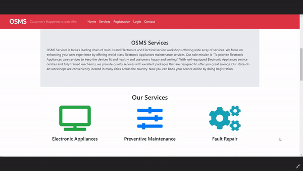

# OSMS (Online Service Management System)
 Online Service Maintenance System or Online Maintenance Management System with payment gateway is a complete Web Application that is written in the PHP language!!

My own video can be found [here](https://www.youtube.com/watch?v=fH2DL4ChV2Y).

# Installation

1. Install XAMPP or WAMPP.

2. Open XAMPP Control panal and start [apache] and [mysql] .

3. Download project from github(https://github.com/vikasbairagi786/OSMS)  
    OR follow gitbash commands
    
    `cd C:\\xampp\htdocs\`
    
    `git clone https://github.com/vikasbairagi786/OSMS.git`
 
    
4. extract files in C:\\xampp\htdocs\.

5. open link localhost/phpmyadmin

6. click on new at side navbar.

7. give a database name as `newosms` hit on create button.

8. after creating database name click on import.

9. browse the file in directory[OSMS//newosms.sql].

10. after importing successfully.

11. open any browser and type `http://localhost/OSMS`.

# Contributing ✨

Pull requests are welcome. If you have any idea or suggestions or issues please open an issue first to discuss.

Thank you :)

 

